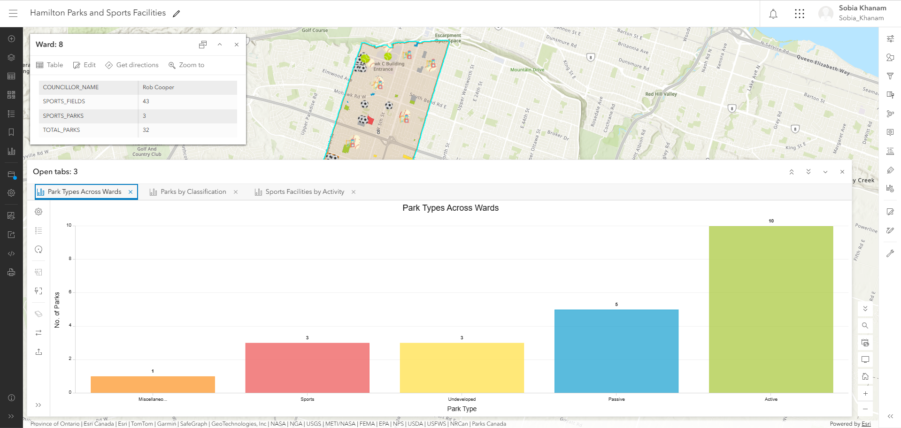
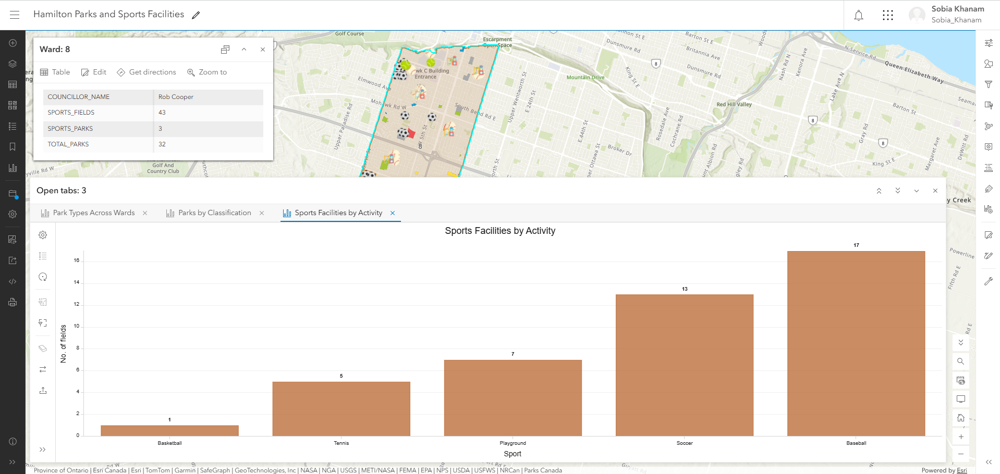
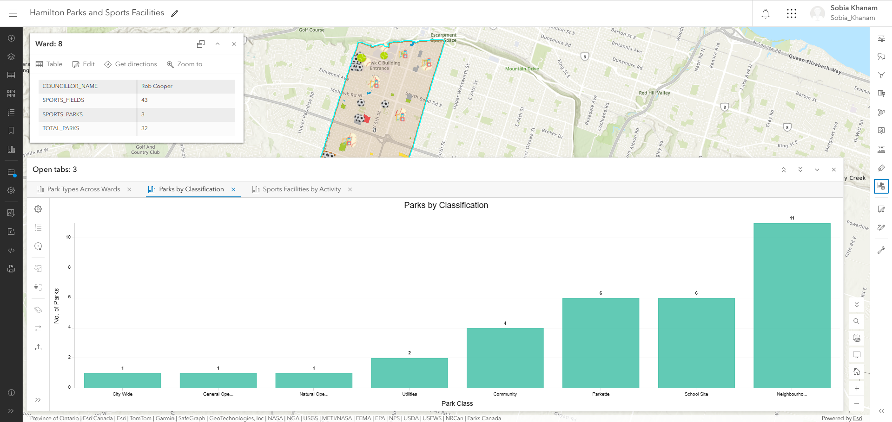
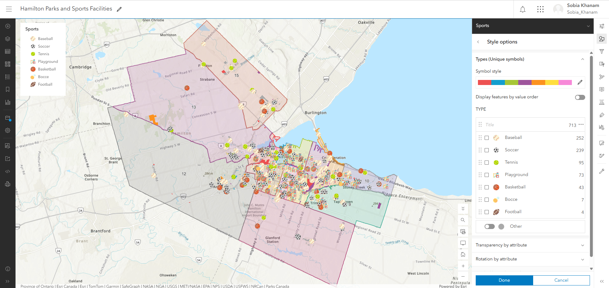

# Hamilton Parks & Recreation GIS Analysis

## Overview

This project demonstrates my practical experience working with **GIS data, spatial analysis, and web mapping** using **ArcGIS Location Platform** and open data from the **City of Hamilton**.

The project explores the distribution of parks and sports facilities across Hamilton's wards and presents the results through an interactive web map.

## Project Objectives

* Explore and visualize Hamilton's parks and recreation data.
* Analyze the distribution of parks across municipal wards.
* Examine park types and classifications.
* Analyze sports facilities by sport type.
* Identify differences in recreation resources across wards.
* Build an interactive map with informative pop-ups and thematic visualization.

## Data Sources

The analysis uses publicly available datasets from the **City of Hamilton Open Data Portal**, including:

* Ward Boundaries
* Parks
* Sports Fields

The datasets were prepared and combined using spatial data processing techniques to support ward-level analysis.

## GIS & Analytical Methods

The project involved:

* Loading and visualizing spatial datasets in ArcGIS.
* Working with polygon and point feature layers.
* Spatially associating parks and sports facilities with municipal wards.
* Creating ward-level summaries and counts.
* Developing thematic map visualizations.
* Configuring interactive pop-ups.
* Applying attribute-based filtering.
* Designing the map to support exploration of recreation resources by ward.

For park-to-ward assignment, park locations were associated with wards using their spatial location/centroid, while sports field points were associated directly with the ward polygons.

## Key Visualizations

### 1. Park Distribution by Type

Shows the distribution of parks across different park types and helps identify the composition of Hamilton's park inventory.



### 2. Sports Facilities by Sport Type

Shows the distribution of sports fields and facilities by sport type.



### 3. Park Distribution by Classification

Shows the distribution of parks according to their classification.



### 4. Ward-Level Recreation Map

The web map combines ward boundaries, parks, and sports facilities to provide a spatial view of recreation resources across Hamilton.



## Tools & Technologies

* **ArcGIS Location Platform**
* ArcGIS web mapping
* GIS spatial analysis
* Spatial joins
* GeoJSON
* Python
* GeoPandas
* Pandas
* City of Hamilton Open Data

## Project Structure

```text
Hamilton-Parks-GIS/
│
├── README.md
│
└── images/
    ├── hamilton-map.png
    ├── park-type.png
    ├── sport-type.png
    └── park-class.png
```

## Limitations

This project was developed using an **ArcGIS Location Platform** account, which provides a more limited set of application and sharing capabilities than a full ArcGIS Online organizational account.

As a result, this repository provides screenshots and documentation of the completed web map rather than a publicly hosted interactive application.

The project is intended as a **portfolio demonstration of GIS data preparation, spatial analysis, visualization, and web mapping workflows**.

## What I Learned

Through this project, I gained practical experience with:

* Working with municipal open spatial data.
* Understanding and preparing GIS feature layers.
* Performing spatial relationships between datasets.
* Creating ward-level analytical summaries.
* Designing web maps for data exploration.
* Communicating spatial insights through interactive visualization.

## Data Attribution

Data used in this project is sourced from the **City of Hamilton Open Data Portal** and is used for demonstration and portfolio purposes.

The underlying datasets remain the property of their respective data providers.
